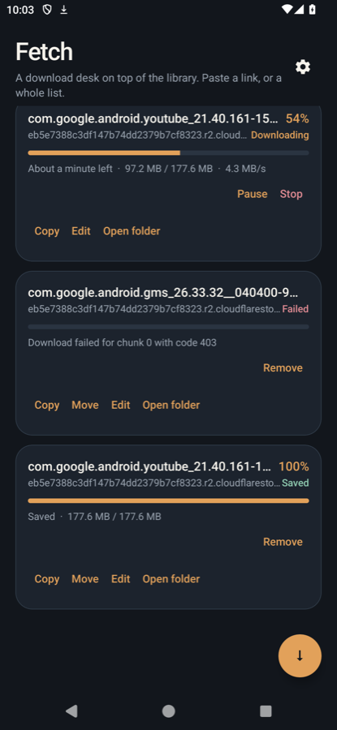
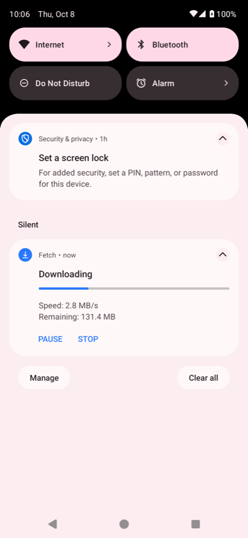
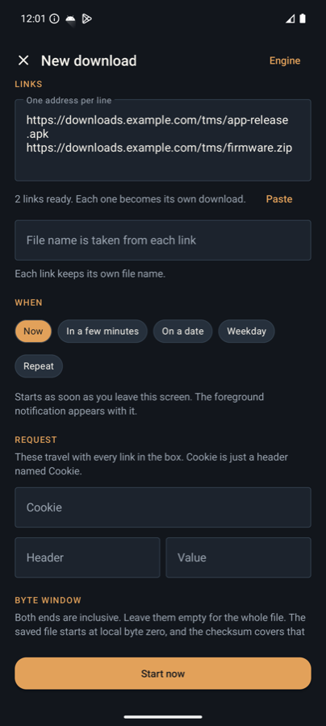
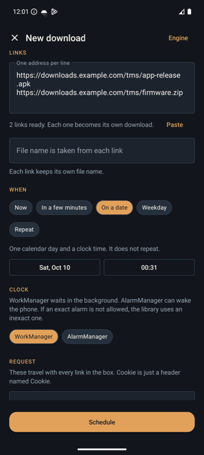
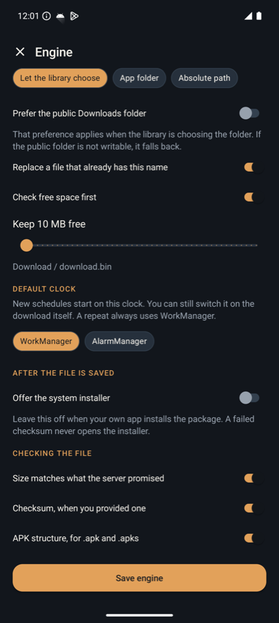

# Mobile Download Manager

[](https://www.jitpack.io/#mirajabi/MobileDownloadManeger)

Android library for large file downloads: parallel ranges, pause and resume, a foreground notification, and a schedule that survives process death. The current release is `v1.3.7`. Minimum SDK is 23.

The host app keeps ownership of extraction, package identity, and installation. The library downloads a file and can optionally open the system installer. It does not install a package by itself.

## Install

Kotlin (`settings.gradle.kts` or the root `build.gradle.kts`):

```kotlin
repositories {
    maven("https://jitpack.io")
}
```

```kotlin
dependencies {
    implementation("com.github.mirajabi:MobileDownloadManeger:v1.3.7")
}
```

Java / Groovy:

```groovy
repositories {
    maven { url 'https://jitpack.io' }
}
```

```groovy
dependencies {
    implementation 'com.github.mirajabi:MobileDownloadManeger:v1.3.7'
}
```

The library manifest already merges `INTERNET`, the foreground-service permissions, the download service, the alarm and notification receivers, and a `FileProvider`. Call `configureService` once before the first download so those components load your settings instead of the defaults.

## Download the built tag

Each tag is built and unit-tested on GitHub Actions, then the output is attached to that release. JitPack builds the same tag when Gradle asks for it. The release files are the reference copies:

| File | What it is |
|---|---|
| `mobile-download-manager-<tag>.aar` | The library, release build |
| `fetch-<tag>.apk` | The Fetch sample, debug-signed so it can be installed |
| `SHA256SUMS` | Checksums of those files |

The current files are on the [v1.3.7 release](https://github.com/mirajabi/MobileDownloadManeger/releases/tag/v1.3.7).

## Read the guide

The guide is numbered. Every step has a Kotlin sample and a Java sample, and every section ends with that section filled in, including the optional fields.

- [Step-by-step index](docs/README.md)
- [Guide with a Kotlin / Java switch](https://mirajabi.github.io/MobileDownloadManeger/)

The switch runs on GitHub Pages. One control at the top shows either Kotlin or Java for every step. GitHub's file view only shows the HTML source, so the page above is the one to open.

## Try it in Fetch

`showcase` is a separate app that sits on this library. Paste one link or several, pick a time, and turn the engine options on from the screen. A failed row can resume from the bytes already saved. A finished file can be copied, moved, renamed, or opened in its folder. The home screen can hold a Fetch widget, and a setting can offer a copied link.

Run the `showcase` module from Android Studio. The [Fetch source guide](https://mirajabi.github.io/MobileDownloadManeger/fetch/) gives each file its own page, with the explanation beside the code. The [library guide](https://mirajabi.github.io/MobileDownloadManeger/) repeats the calls in Kotlin and Java.

<p align="center">
  
  
  
  
  
</p>

## What a download does

- A request can keep a byte window. `rangeStart` and `rangeEndInclusive` are both inclusive. Leave them unset to take the whole file. The saved file contains only that window, and the checksum covers those bytes.
- Several connections run together when `chunkCount` is greater than one. Headers, including `Cookie`, travel on `DownloadRequest.headers`.
- A changed strong ETag or a changed total size starts again from byte zero. A missing or weak ETag keeps the partial file. The checksum is the final check.
- A manual pause stays paused across reboot. A download that was queued, running, or waiting to retry continues from the last flushed checkpoint. A failed download stays failed until `resume` is called, and that resume continues from the flushed bytes. There is no boot receiver. After a force-stop, Android allows that work again when the app may run.
- A second request for the same file is rejected while the first one is queued, running, waiting to retry, or paused. If the first one already failed or was cancelled, the new request starts from byte zero.
- Pause and Stop are not network errors, so they are not started again by the scheduler.
- A missing or corrupt saved configuration uses `DownloadConfig` defaults. The service does not crash in `onCreate`.

## Changelog

### v1.3.7

JitPack can build the tag again. Its image points `JAVA_HOME` at `/usr/lib/jvm/jdk-11` and does not let the build user create that directory, so Gradle never started. Temurin 11 is installed under the home directory, and the wrapper uses it when the exported home has no `java`. The published coordinates follow the tag JitPack requests.

### v1.3.6

`resume` continues a failed download from its recovery record. A new enqueue of that id still starts at byte zero, and reboot still does not auto-start a failure. The guide walks the Fetch sample from process start through the queue, clipboard offer, and home-screen widget.

### v1.3.5

Public Downloads can keep a relative folder. `storagePublicDownloadsFolder("Fetch")` writes into `Download/Fetch` when that directory is writable, and otherwise the download continues in an app directory. A failure to choose a folder is reported on the download instead of stopping the process. Fetch, the sample app, can copy or move a finished file, rename it, keep the link, and open the folder the file landed in.

### v1.3.4

A download can keep a chosen byte window. Set `rangeStart` and `rangeEndInclusive` on `DownloadRequest`; both ends are inclusive, and either one can be left open. The file on disk contains only that window. Parallel connections stay on `chunkCount`, and cookies stay in `headers` under the name `Cookie`.

### v1.3.3

Interrupted downloads continue from the last checkpoint. A ranged response is kept only when it is the same artifact, and a second request cannot write into a file that is still healthy. The usage guide in `docs/` walks through every setting in Kotlin and Java. JitPack's current image points `JAVA_HOME` at a JDK 11 directory it no longer ships, so the tag installs Temurin 11 there before Gradle starts.

## Requirements

| | |
|---|---|
| minSdk | 23 |
| Artifact | `com.github.mirajabi:MobileDownloadManeger:v1.3.7` |
| Foreground service type | `dataSync` |
| Periodic schedule floor | 15 minutes |
